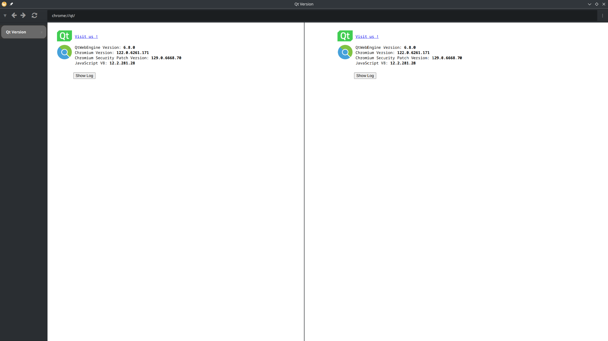

# hyperion

qt6 based web browser

- Started experimenting with rust. But the build times are killing my ADD stuff.
- Switching to fucking C++ for creating UI. (Gosh what days)
- Guess I will just have to write safe code, coz I haven't got all day.

## Features

- [x] Auto SSL routing for http, ftp, pop3, imap, ws
- [x] Best effor autofix common mistakes in url, like `https:// `, removing spaces.
- [ ] Best effort malicious url detection, tensorflow lite
- [x] Use a tiling manager
- [ ] See how to copy without Site Tracking by default.
- [ ] Split Screen
- [ ] Setting Page, need to handle custom schemes like about:, will see.
- [ ] Profile export
- [ ] Bookmarks
- [ ] Indexing bookmarks
- [ ] Improve the address bar to support scriptable plugins
    - Plugins can be, like mozilla doing, @google, @search-engine
    - Inbuilt functionality, like @seach , to search across bookmarks
- [ ] Inbuilt tampermoney like shit
- [ ] Inbuilt ublock origin, or see how to import that plugin.
- [ ] Setup schedulers and trackers on webpages, based on config (resource intensive)
- [ ] Check if `fetch` and all are working, properly, with https enabled automatically.
- [ ] Allow `User-Agent` change. URL based, or RoundRobin based
- [ ] See if its possible to inject SSL certificates for MITM
- [ ] Think about allowing vim-motions. No one got it right.
- [ ] Check security of cookies and stuff
- [ ] Make the browser UI configurable
    - sidebar and background and shit like
    - !important allow the address bar to be at bottom, and sidebar to right
    - themes?

### Tiling Manager

Wanted to write it in rust/go/zig and interop with c++, but fucking hell.
- Cgo sucks balls
- Rust, learning it itself is a pain in the ass. I am going to just keep the library as is
- Zig, thought of using zig instead of c++ for the project, but Zig only has c interop. And I ain't spending another day running after this BS

So tiler is written in C++.
